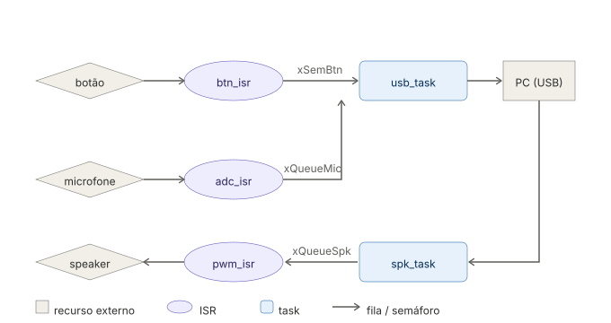

# Controle do Claude

Controle físico que captura áudio do usuário, transcreve via API, envia para o Claude e reproduz a resposta em áudio. 

## O que é o projeto

Raspberry Pi Pico 2 conectado por USB a um PC. O usuário aperta um botão, fala, solta o botão. O Pico envia o áudio ao PC, que chama Whisper (transcrição) → Claude (resposta) → TTS (síntese), e devolve o áudio para o Pico tocar no speaker.

## Ideia do controle (sketch)

```
        ___________________________
       /                           \
      |          ⬤  BOTÃO          |
      |                             |
      |     [ MIC ]      ● LED      |
      |    ░░░ SPEAKER ░░░          |
       \_________________________/
                    |
                  USB-C
```

## Inputs e Outputs

| | Componente | Pino |
|---|---|---|
| Input | Microfone MAX9814 | GP28 (ADC2) |
| Input | Botão push-to-talk | GP3 |
| Output | Speaker (PWM + filtro RC + TPA2012) | GP26 |
| Output | LED de status | GP4 |

## Protocolo

Comunicação por USB CDC (serial virtual). Frames:

```
[ 0xAA ][ TYPE ][ LEN ][ PAYLOAD ]
```

| TYPE | Direção | Significado |
|---|---|---|
| `0x01` | Pico → PC | bloco de áudio (16-bit, 16 kHz) |
| `0x02` | PC → Pico | bloco de áudio (16-bit, 16 kHz) |
| `0x10` | Pico → PC | botão pressionado |
| `0x11` | Pico → PC | botão solto |

## Diagrama de blocos do firmware

